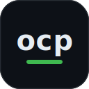

<div align="center">



# ocp

**Isolated [opencode](https://opencode.ai) profiles — config, auth, sessions, and omo, switched per directory.**


<p><a href="https://xterr.github.io/ocp/"><b>Documentation</b></a> · <a href="https://github.com/xterr/ocp/releases"><b>Releases</b></a></p>


</div>

---

## Why ocp?

Juggling work and personal opencode accounts means hand-swapping env vars and clobbering your
sessions. `ocp` gives each project its own auth, session history, and config — and switches
automatically based on the directory you're in. Think **`direnv` for opencode**.

- 🔐 **Multiple accounts, simultaneously** — separate `auth.json` per profile; no more logging out.
- 📁 **Auto-switched per directory** — drop a `.ocprofile` in a repo and you're on the right account.
- 🪶 **Zero dependencies** — one Bash script, no daemon, no config format to learn.

`ocp` lets you run opencode under named **profiles** — *work*, *personal*, *client* — each with its own
authentication, session history, and configuration (`opencode.json`, agents, skills, plugins, and your
`oh-my-openagent.json`). Pick a profile explicitly, set a global default, or let it switch **automatically**
based on the directory you're in. It is a single, dependency-free Bash script that sets two environment
variables opencode already understands — nothing more.

## Features

- **Isolated auth** — separate `auth.json` per profile; stay logged into multiple accounts at once.
- **Isolated sessions** — separate session database per profile.
- **Isolated config** — separate `opencode.json`, `AGENTS.md`, agents, skills, plugins, and omo setup.
- **Automatic per-directory profiles** — a `.ocprofile` file activates a profile for a whole project tree.
- **Bring your own secrets** — plain env files, macOS Keychain, 1Password, or any wrapper command.
- **Zero runtime dependencies** — one Bash script; no daemons, no config format to learn.

## Install

```sh
curl -fsSL https://raw.githubusercontent.com/xterr/ocp/main/install.sh | bash
```

Pass a profile name (defaults to `default`):

```sh
curl -fsSL https://raw.githubusercontent.com/xterr/ocp/main/install.sh | bash -s -- work
```

The installer downloads `ocp` from the latest [release](https://github.com/xterr/ocp/releases) into
`~/.local/bin`, creates the profile, sets it as the default, and wires the shell integration into the
right rc file. Use `--no-shell` to skip the rc change, or `--version <x.y.z>` to pin a specific release.

**Works with zsh, bash, and fish.** `ocp` itself is a Bash script, so it needs **Bash ≥ 4 installed as its
interpreter** (macOS ships 3.2 — `brew install bash`) — but *not* as your login shell. The installer
detects your shell and adds the matching integration.

<details>
<summary>Manual install</summary>

```sh
# download the latest release binary onto your PATH:
curl -fsSL https://github.com/xterr/ocp/releases/latest/download/ocp -o ~/.local/bin/ocp
chmod +x ~/.local/bin/ocp

# zsh / bash — add to ~/.zshrc or ~/.bashrc:
eval "$(ocp init-shell)"

# fish — add to ~/.config/fish/config.fish:
ocp init-shell --shell fish | source
```

`init-shell` auto-detects your shell from `$SHELL`; pass `--shell zsh|bash|fish|posix` to override.
`opencode` and `oh-my-openagent` must be available too.

</details>

## Quick start

```sh
ocp create work --description "Work account"   # scaffold a profile
ocp use work                                    # set the global default
ocp launch -p work -- auth login                # authenticate (once per profile)
opencode                                         # runs under the active profile
```

After `eval "$(ocp init-shell)"` is in your shell, plain `opencode` is profile-aware.

## How isolation works

opencode reads its directories from environment variables. `ocp` sets only the two that matter, scoped to
the launched process:

| What | Variable | Resolves to | Isolated |
| --- | --- | --- | --- |
| config + omo | `OPENCODE_CONFIG_DIR` | `<profile>/config` | yes |
| auth + sessions | `XDG_DATA_HOME` | `<profile>/data` | yes |
| binary cache | *(untouched)* | shared | shared on purpose |

Everything else is a child of those two directories, so it is isolated automatically.

## Per-directory switching

Drop a `.ocprofile` file in a project and any `opencode` launched within it uses that profile:

```sh
cd ~/work/some-repo
ocp pin work          # writes ./.ocprofile
opencode              # uses the 'work' profile
```

`ocp` walks up from the current directory to find the nearest `.ocprofile`. It only selects one of your
profiles — it never runs code.

### Resolution order

1. `-p <name>` flag
2. `$OCP_PROFILE`
3. nearest `.ocprofile`
4. global default (`ocp use`)
5. none → plain opencode

If the resolved profile no longer exists, an explicitly requested one (`-p`, `$OCP_PROFILE`, or a
`.ocprofile`) is a hard error, while a stale global default is ignored — opencode just runs without
a profile (case 5).

## Secrets & environment

Each profile has two optional hooks. Edit them with `ocp edit <name> --what env|manifest`.

**`env` file** — `<profile>/env`, sourced as Bash before launch. Use static values or pull from any store:

```sh
OPENAI_API_KEY=sk-...                                                  # static
export ANTHROPIC_API_KEY="$(security find-generic-password \
  -a "$USER" -s opencode-work -w)"                                     # macOS Keychain
export OPENAI_API_KEY="$(op read 'op://Work/openai/credential')"       # 1Password
```

**`WRAPPER`** — a command prefix in the manifest, with `{profile_dir}` / `{config_dir}` / `{data_dir}`
substitution, for tools that inject env into a child process:

```sh
ocp create work --wrapper 'op run --no-masking --env-file={profile_dir}/secrets.env --'
```

## Commands

| Command | Description |
| --- | --- |
| `ocp create <name> [flags]` | Create a self-contained profile |
| `ocp list` | List profiles; marks the default and the one active here |
| `ocp current` | Print the profile active in this directory |
| `ocp resolve [dir]` | Show the resolved profile, its source, and paths |
| `ocp use <name>` | Set the global default profile |
| `ocp rename <old> <new>` | Rename a profile (repoints the default if it pointed at it) |
| `ocp launch [-p name] -- <args>` | Run opencode under a profile (isolated env) |
| `ocp pin <name> [dir]` | Write a `.ocprofile` |
| `ocp edit <name> [--what …]` | Open a profile's config / manifest / env / data |
| `ocp path <name>` | Print a profile's directories |
| `ocp remove <name> [--purge-data]` | Remove a profile |
| `ocp init-shell [flags]` | Print shell integration to `eval` |
| `ocp self-update [version]` | Update `ocp` to the latest release (or a specific version) |

`create` flags: `--from <dir>`, `--seed-auth`, `--env-file <file>`, `--wrapper <cmd>`, `--description <text>`,
`--force`. Run `ocp <command> --help` for details.

## Layout

```
~/.config/ocp/
├── ocp.json                     # managed state: $schema, version, default profile
└── profiles/<name>/
    ├── profile.env              # manifest: DESCRIPTION, WRAPPER, DEFAULT_ARGS
    ├── env                      # optional: sourced before launch
    ├── config/                  # OPENCODE_CONFIG_DIR (opencode.json, omo, agents, …)
    └── data/opencode/           # XDG_DATA_HOME (auth.json, sessions, …)
```

Override the root with `OCP_HOME`.

## Build from source

The script is generated with [bashly](https://bashly.dev). Edit files under `src/`, then:

```sh
bashly generate                  # development build
bashly generate --env production # slimmer release build
```

The generated `ocp` is **not committed** — it is a build artifact produced by `bashly generate` and
attached to each GitHub release by CI. Never hand-edit it. Help-text colors live in `settings.yml`;
runtime color follows your terminal and the [`NO_COLOR`](https://no-color.org) standard.

## Releasing

`src/bashly.yml`'s `version:` field is the single source of truth. To cut a release:

```sh
# 1. bump `version:` in src/bashly.yml, then regenerate and commit
bashly generate
git commit -am "release 1.2.3"

# 2. tag with the exact version (no v prefix) and push the tag
git tag 1.2.3
git push origin main 1.2.3
```

Pushing the tag triggers [`release.yml`](.github/workflows/release.yml): it verifies the tag matches
`src/bashly.yml`, builds the production `ocp` with bashly, and publishes a GitHub Release with `ocp`
attached. The docs site redeploys to GitHub Pages automatically on every push to `main` that touches
`docs/`.

## Uninstall

```sh
rm ~/.local/bin/ocp              # remove the command
rm -rf ~/.config/ocp             # remove all profiles, auth, and sessions (destructive)
```

Then remove the `# ocp` block from your shell rc.

## License

[MIT](LICENSE) © xterr
